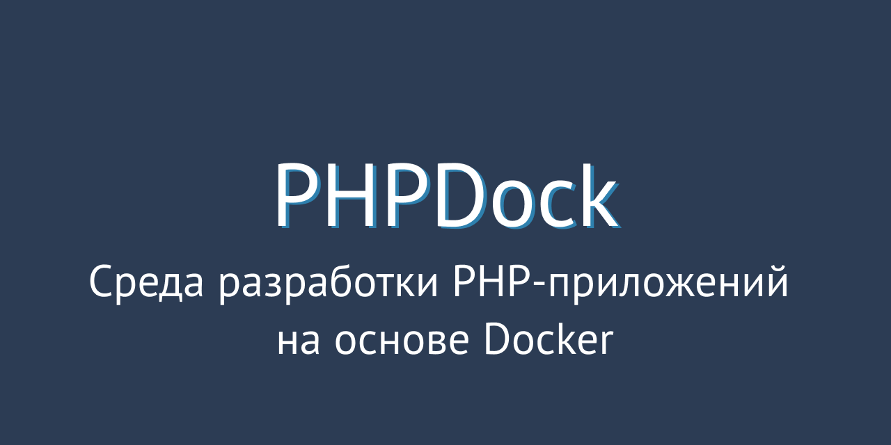
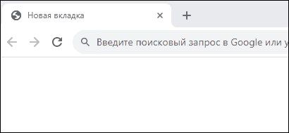

# PHPDock



## Описание
PHPDock - это среда разработки PHP-приложений на основе Docker. 

Проект предоставляет набор предварительно настроенных Docker-образов, включая NGINX, MySQL, PHP, Adminer, а также другие необходимые образы.

PHPDock может использоваться как основа для создания новых PHP-приложений, а также как песочница для изучения и тестирования PHP-кода.
## Системные требования
- [Git](https://git-scm.com/book/ru/v2/Введение-Установка-Git),
- [Docker](https://docs.docker.com/get-docker/),
- Makefile.
## Установка
1. Клонировать репозиторий:
```
git clone https://github.com/marchenkovma/phpdock.git
```
2. Перейти в папку с проектом:
```
cd phpdock
```
3. Сделать копию файла `env.example` и переименовать его в `.env`.
4. Запустить проект:
```
make start
```
5. Открыть в браузере ссылку [http://localhost:8000](http://localhost:8000) или выполнить команду в консоли ```make php```.

Результат в браузере:



Результат в консоли:


## Использование
### Проект
Запускает проект:
```
make start
```
Останавливает проект:
```
make stop
```
Перезапускает проект:
```
make restart
```
### PHP
Запускает PHP-скрипт по умолчанию (public/index.php) внутри контейнера:
```
make php
```
Запускает указанный PHP-скрипт (public/index.php) внутри контейнера:
```
make php public/index.php
```
Выводит версию PHP внутри контейнера:
```
make php -- -v
```
Запускает PHP в интерактивном режиме внутри контейнера:
```
make php -- -a
```
### Composer
Устанавливает зависимости, указанные в файле composer.lock, или создает его, если он отсутствует:
```
make composer install
```
Обновляет зависимости согласно composer.json и обновляет composer.lock:
```
make composer update
```
Добавляет указанный пакет в зависимости проекта:
```
make composer require nikic/fast-route
```
Удаляет указанный пакет из зависимостей проекта:
```
make composer remove nikic/fast-route
```
Обновляет автозагрузчик классов Composer:
```
make composer dump-autuoload
```
### Проверка синтаксиса
Проверяет код на соответствие стандартам кодирования:
```
make phpcs
```
Автоматически исправляет ошибки кодирования, обнаруженные phpcs:
```
make phpcbf
```
### Консоль
Подключается к оболочке sh внутри контейнера:
```
make sh
```
## FAQ


При выполнении команды `make start` на macOS возникает ошибка:
``` Error response from daemon: Mounts denied:
The path /Users/<username>/.phpdock/data/mysql is not shared from the host and is not known to Docker.
You can configure shared paths from Docker -> Preferences... -> Resources -> File Sharing.
See https://docs.docker.com/desktop/mac for more info.
```
1. Обновите Docker Desktop до последней версии (4.28.0 139021 и выше).
2. Настройте ресурсы в Docker Desktop: перейдите в Docker Dekstop -> Settings -> Resources -> File Sharing и добавьте следующие пути:
```
/Users/<username>/.phpdock
/Users/<username>/PhpstormProjects/phpdock
```
3. Перезапустите Docker Desktop.
4. Повторите команду `make start`.
---
## Автор
- [Максим Марченков](https://marchenkov.by)
## Лицензия
Этот проект лицензируется на основе лицензии [MIT](LICENSE).
